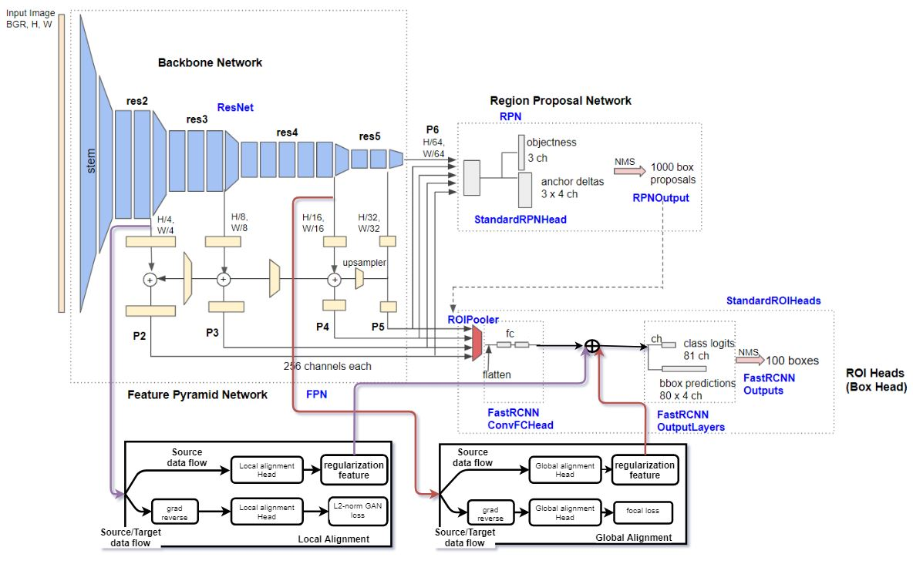

# A Detectron2 Implementation of [Strong-Weak Distribution Alignment for Adaptive Object Detection](https://arxiv.org/pdf/1812.04798.pdf) (CVPR 2019)
Official implementation: [VisionLearningGroup/DA_Detection](https://github.com/VisionLearningGroup/DA_Detection)

### Features
now only supports [ResNet50-FPN](https://github.com/facebookresearch/detectron2/blob/main/configs/Base-RCNN-FPN.yaml)
1. local alignment (image alignment)
2. global alignment (image alignment)
3. context vector base regularization
4. Few-shot tuning

### Network architecture
  

### Environment
```
python 3.8.11
pytorch 1.9.0 (conda)
torchvision 0.10.0 (conda)
detectron2 0.5+cu111 (cuda is optional, detectron2 has cpu version) (pip)
tensorboard 2.6.0 (pip)
opencv-python (pip)
pycocotools (pip)
```
### Data preparation

1. make your dataset format to voc (recommended) or coco, or [other format](https://detectron2.readthedocs.io/en/latest/tutorials/builtin_datasets.html) that detectron2 supports
2. register your dataset at [faster_rcnn/data/register.py](https://github.com/Shuntw6096/swda-detectron2/blob/main/faster_rcnn/data/register.py)

```python
# VOC format
dataset_dir = $YOUR_DATASET_ROOT
classes = ('person', 'two-wheels', 'four-wheels') # dataset classes
years = 2007
# to find image list at $YOUR_DATASET_ROOT/ImaegSets/Main/{$split}.txt, only "train", "test", "val", "trainval"
split = 'train'
# call your dataset by this
meta_name = 'itri-taiwan-416_{}'.format(split)
# call register_pascal_voc to register
register_pascal_voc(meta_name, dataset_dir, split, years, classes)


# coco format
json_file_path = $YOUR_COCO_JSON_PATH
image_root = $YOUR_IMAGE_DIR_PATH
split = 'test'
# call your dataset by this
meta_name = 'tokyo-320-test_{}'.format(split)
# 'thing_classes' contains dataset classes information, be aware of class order
meta_data = {'thing_classes':['person','two-wheels','four-wheels']}
# call register_coco_instances to register
register_coco_instances(meta_name, meta_data, json_file_path, image_root)
```

### Configuration file explanation
``` yaml
# load some basic settings
_BASE_: "./Base-RCNN-FPN.yaml"
# dataset settings, souce and target domain dataset, but test set does not have domain setting
DATASETS:
  # domain adaptation trainer's training setting
  SOURCE_DOMAIN:
    TRAIN: ("itri-taiwan-416_train",)
  TARGET_DOMAIN:
    TRAIN: ("tokyo-320-v2_train",)
  # default trainer's training setting,
  # when not using domain adaptation, load this training set to train noraml faster-rcnn
  TRAIN: ("itri-taiwan-416_train",)
  TEST: ("tokyo-320_test",)

# Model settings
MODEL:
  META_ARCHITECTURE: "SWDARCNN"
  BACKBONE:
    NAME: "build_resnet_fpn_da_backbone"
    # resnet has 5 stages, only freeze stem, same as original swda setting
    FREEZE_AT: 1
  WEIGHTS: "detectron2://ImageNetPretrained/MSRA/R-50.pkl"
  KEYPOINT_ON: False
  MASK_ON: False
  # determine whether to use domain adaptation or not, if not, just a normal faster-rcnn
  DOMAIN_ADAPTATION_ON: True
  ROI_HEADS:
    NAME: "DAROIHeads"
    IN_FEATURES: ["p2", "p3", "p4", "p5"]
    # same as dataset class, it not count background in 
    NUM_CLASSES: 3
    # it is fixed, feature name
    CONTEXT_REGULARIZATION_FEATURES: ["local_head_feature", "global_head_feature"]
    # determine whether to use context vector base regularization or not
    CONTEXT_REGULARIZATION_ON: True
    # determine confidence threshold, 
    # boxes are outputed on images while testing if its confidence is above threshold
    SCORE_THRESH_TEST: 0.75
  ROI_BOX_HEAD:
    # if using context vector base regularization, it is fixed
    FC_DIM: 256

  # Domain adaptation head settings
  DA_HEADS:
    # determine whether to use local alignment and global alignment or not
    LOCAL_ALIGNMENT_ON: True
    GLOBAL_ALIGNMENT_ON: True
    # hyper parameter, focal loss at global alignment head
    GAMMA: 3.0

# Optimizer settings, it supports all optimizer features in detectron2
SOLVER:
  IMS_PER_BATCH: 1 # batch size, it is fixed, same as original swda setting
  LR_SCHEDULER_NAME: WarmupCosineLR
  STEPS: (60000, 100000)
  BASE_LR: 0.001
  # total iteration
  MAX_ITER: 150000
  # determine how many steps to save checkpoint
  CHECKPOINT_PERIOD: 10000

TEST:
  # determine how many steps to run inference on test set to get metric(mAP), 0 is not to run
  EVAL_PERIOD: 10000

# Few-shot tuning settings
FEWSHOT_TUNING:
  # determine whether to use domain adaptation tuner to tune network,
  # it is designed for inverse domain tuning.
  # If False, use training set being source data to tune network with few-shot tuner
  DOMAIN_ADAPTATION_TUNING: True
  MODEL:
    # the path of model weight being tuned
    WEIGHTS: ""
    # determine whether to freeze backnone (feature extractor) during tuning 
    BACKBONE_FROZEN: False
    # determine whether to freeze domain adaptation head during tuning 
    DA_HEADS_FROZEN: False

  DATASETS:
    # domain adaptation tuner's training setting
    SOURCE_DOMAIN:
      TRAIN: ("tokyo-320-v2_val",)
    TARGET_DOMAIN:
      TRAIN: ("itri-taiwan-416_val",)
    # few-shot tuner's training setting
    TRAIN: ("tokyo-320-v2_val",)
    TEST: ("tokyo-320_test",)

  # it also support all optimizer features in detectron2
  SOLVER:
    IMS_PER_BATCH: 1 # batch size
    LR_SCHEDULER_NAME: WarmupCosineLR
    STEPS: (40000, 60000)
    BASE_LR: 0.00001
    MAX_ITER: 100000
    # determine how many steps to save checkpoint
    CHECKPOINT_PERIOD: 10000
# determine how many steps to get image record(eg., predicted proposal generated by rpn) during traing,
# smaller to make tfevents file larger 
VIS_PERIOD: 5000
```

* [faster-rcnn_R_50_FPN_1x.yaml](./configs/faster-rcnn_R_50_FPN_1x.yaml) is normal faster rcnn configuration file  
* [swda_rcnn_clg_R_50_FPN_1x.yaml](./configs/swda_rcnn_clg_R_50_FPN_1x.yaml) is faster rcnn with context regularization and local and global alignment configuration file  
* [swda_rcnn_cg_R_50_FPN_1x.yaml](./configs/swda_rcnn_cg_R_50_FPN_1x.yaml) is faster rcnn with context regularization and global alignment configuration file
* [swda_rcnn_lg_R_50_FPN_1x.yaml](./configs/swda_rcnn_lg_R_50_FPN_1x.yaml) is faster rcnn with global and local alignment configuration file

### Usages
* train a model
``` bash
python tools/train_net.py --config-file $CONFIG_FILE_PATH --num-gpus 1
```
* test the model
``` bash
# update MODEL.WEIGHTS by command line
python tools/train_net.py --config-file $CONFIG_FILE_PATH --num-gpus 1 --eval-only MODEL.WEIGHTS $MODEL_WEIGHT_PATH
```
* tuning the model
``` bash
python tools/train_net.py --config-file $CONFIG_FILE_PATH --num-gpus 1 --tuning-only FEWSHOT_TUNING.MODEL.WEIGHTS $MODEL_WEIGHT_PATH
```
* predict boxes on the test set
``` bash
python tools/train_net.py --config-file $CONFIG_FILE_PATH --num-gpus 1 --test-images MODEL.WEIGHTS $MODEL_WEIGHT_PATH  MODEL.ROI_HEADS.SCORE_THRESH_TEST 0.75
```
### Experiments
* Taiwan dataset -> Tokyo dataset

| Backbone        | mAP:iou50 |
| ------------- |:-------------:| 
| vgg16 (official implementation)| 31.28| 
| resnet50-fpn (ours)| 41.11|
| resnet50-fpn after few-shot tuning (ours)| 56.26|
